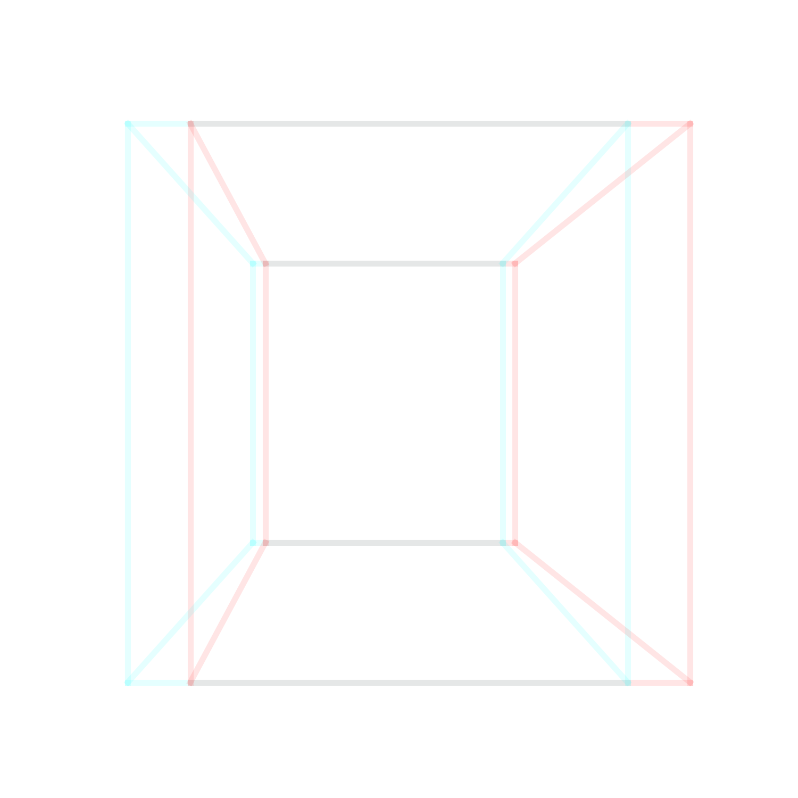
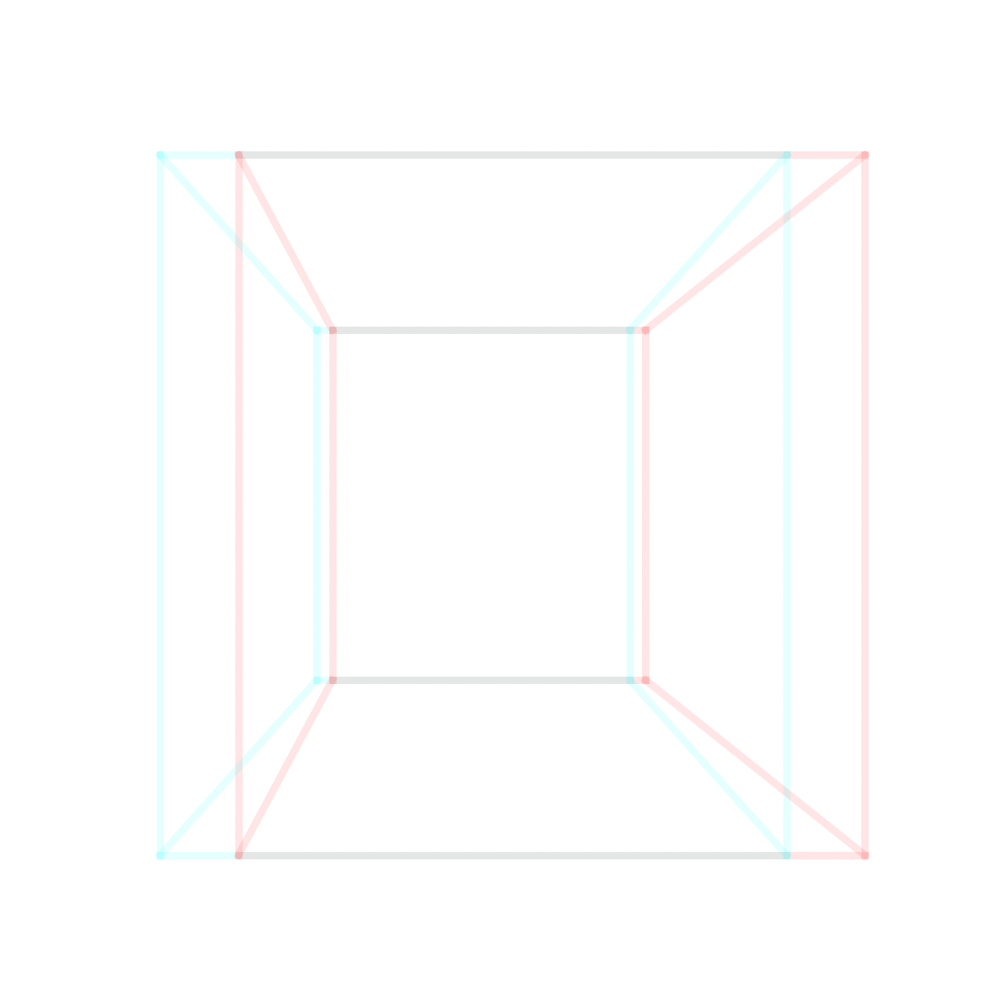

# 3D view

Anaglyphic glasses required to enjoy this 3D image :) (run 'python3 play.py'). The code could not get any simpler.

Or if you want to see modified [solar system](https://en.wikipedia.org/wiki/Solar_System) (numbers modified in order to show something nice). 3D math is heavily flawed as well, just for fun purposes. Run 'python3 play03.py'.

Or you can create [animated gifs](https://averagelinuxuser.com/make-gif-in-linux-with-one-simple-command/) with [ImageMagick](https://imagemagick.org/index.php). (run 'python3 play02.py')

run 'python3 play04.py'

run 'python3 play04b.py'

You need 3D anaglyph glasses. Options:
* [Black Anaglyphic Red Blue Cyan Stereoscopic Lens 3D Glasses](https://www.amazon.com/gp/product/B07NQVZM72/)

* [ZiYan- 50 Pairs - Flat- 3D Glasses Red and Cyan White Frame Anaglyph Cardboard](https://www.amazon.com/gp/product/B0739L6QCP/)

* And just in case you are wondering what monitor I have (as the view was optimized on that monitor), I have [LG 32UD59-B 32" Ultra HD 3840 x 2160](https://www.newegg.com/p/N82E16824025172?Item=9SIA4P064K3732), but I just checked also on my [surface](https://www.microsoft.com/en-us/surface) and experience was pretty trippy as well. Also, left eye should have cyan (blue) filter and right eye red filter. It does matter, otherwise it's flipped (inside of monitor instead of popping out of monitor).

If you have glasses, you can check out also [Grand Teton National Park, Wyoming](https://github.com/loganbyers/anaglypher).
