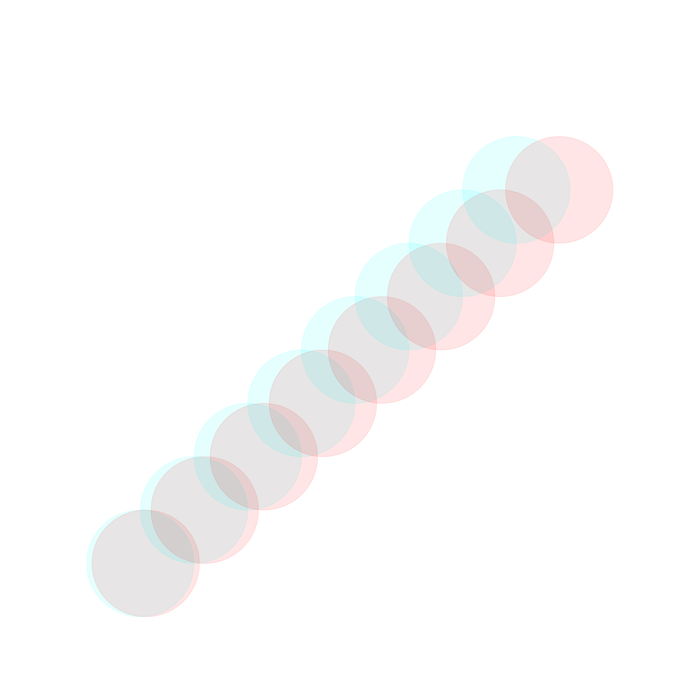
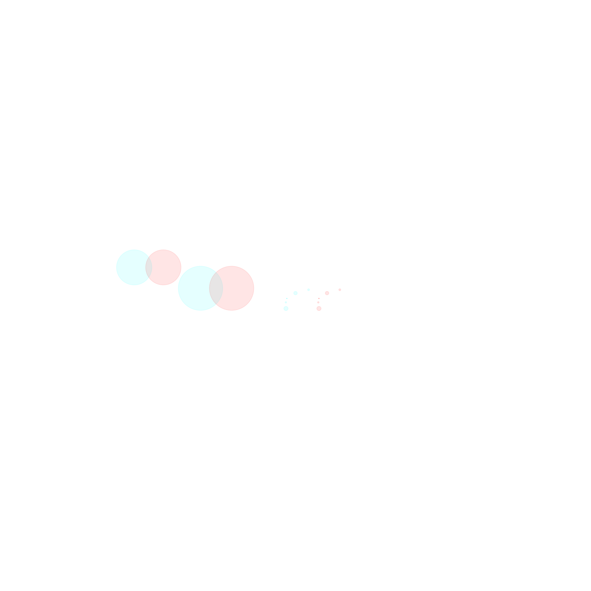
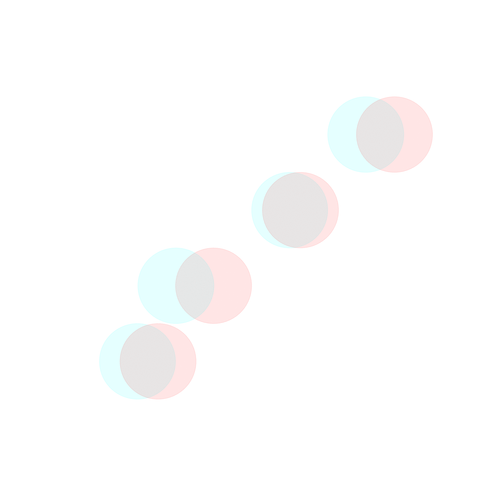
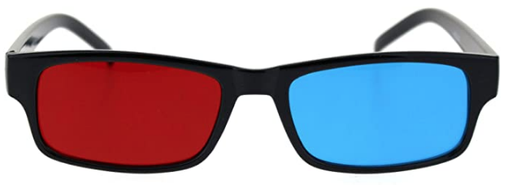
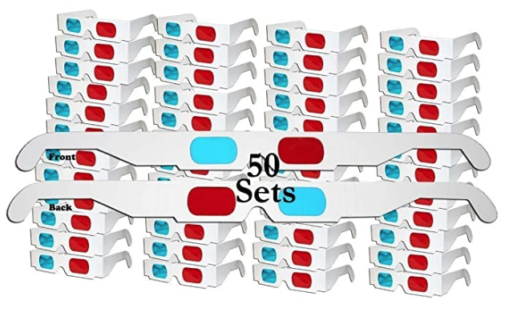

# 3D view

Anaglyphic glasses required to enjoy this 3D image :) (run 'python3 play.py'). The code could not get any simpler.

Or if you want to see modified solar system (numbers modified in order to show something nice). 3D math is heavily flawed as well, just for fun purposes. Run 'python3 play03.py'.

Or you can create [animated gifs](https://averagelinuxuser.com/make-gif-in-linux-with-one-simple-command/) with [ImageMagick](https://imagemagick.org/index.php). (run 'python3 play02.py')

You need 3D anaglyph glasses. Options:
* [Black Anaglyphic Red Blue Cyan Stereoscopic Lens 3D Glasses](https://www.amazon.com/gp/product/B07NQVZM72/)

* [ZiYan- 50 Pairs - Flat- 3D Glasses Red and Cyan White Frame Anaglyph Cardboard](https://www.amazon.com/gp/product/B0739L6QCP/)

* Bucket for puking is optional
